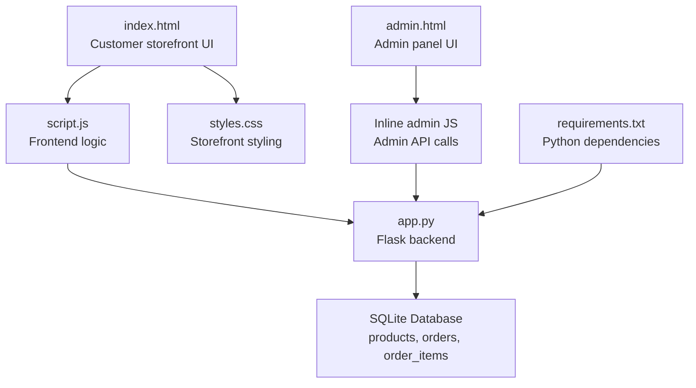
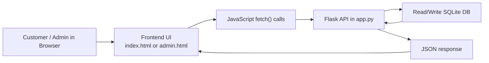
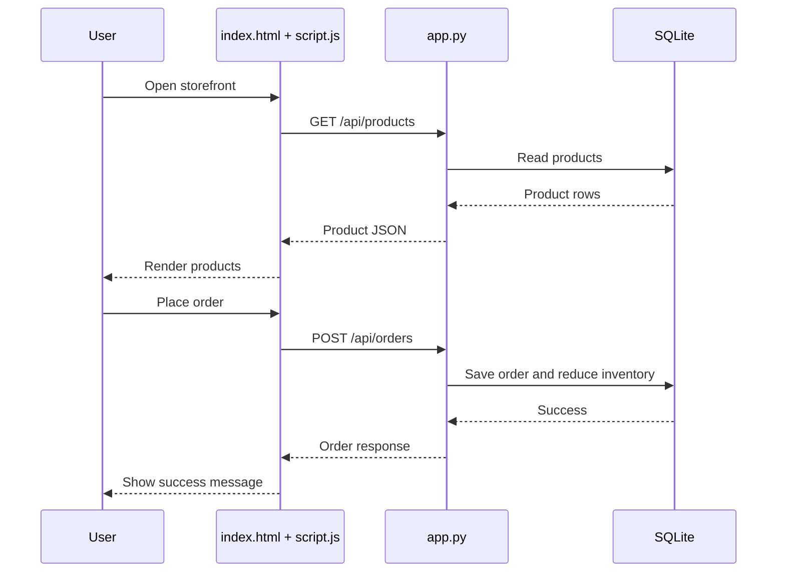
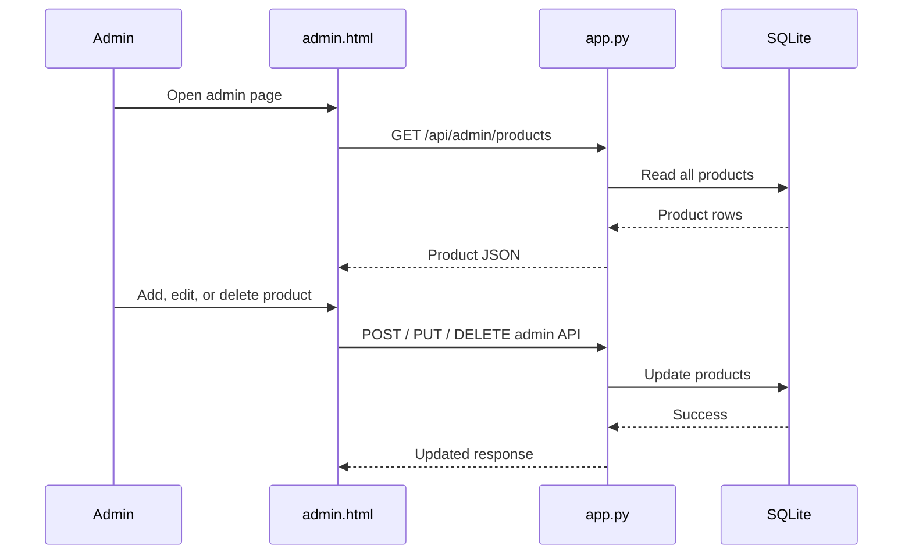

# KeerTea Naturals

KeerTea Naturals is a small full-stack storefront for selling tea, cashew nuts, and spices. The project started as a static HTML/CSS/JavaScript shop and now includes a Python Flask backend, SQLite storage, order handling, inventory tracking, payment integration hooks, and a lightweight admin panel.

## What This Project Does

- Shows products on a customer-facing storefront
- Lets customers add products to a cart and place orders
- Stores customer details and order data
- Tracks product inventory
- Provides an admin panel to add, edit, and delete products
- Lets admins view incoming orders
- Prepares backend integration points for Razorpay and Stripe

## Tech Stack

- Frontend: HTML, CSS, JavaScript
- Backend: Python, Flask
- Database: SQLite
- Payments: Razorpay / Stripe integration hooks in backend

## Project Files

### Frontend

- [index.html](C:\Users\mihir\OneDrive\Desktop\DAILY\Tapri\index.html)
  Customer storefront page. Contains the layout for hero, benefits, product grid, cart drawer, checkout modal, and footer.

- [styles.css](C:\Users\mihir\OneDrive\Desktop\DAILY\Tapri\styles.css)
  Visual styling for the storefront, including layout, colors, responsiveness, product cards, cart, checkout modal, and animations.

- [script.js](C:\Users\mihir\OneDrive\Desktop\DAILY\Tapri\script.js)
  Frontend behavior. Fetches products from the backend, renders them, manages cart state in the browser, and submits orders to the backend.

### Backend

- [app.py](C:\Users\mihir\OneDrive\Desktop\DAILY\Tapri\app.py)
  Flask application. Serves the storefront and admin panel, initializes the database, exposes APIs, saves orders, updates inventory, and prepares payment requests.

- [requirements.txt](C:\Users\mihir\OneDrive\Desktop\DAILY\Tapri\requirements.txt)
  Python dependency list. Right now it includes Flask.

### Admin

- [admin.html](C:\Users\mihir\OneDrive\Desktop\DAILY\Tapri\admin.html)
  Admin panel UI. Allows product creation, editing, deletion, and order viewing through calls to admin API endpoints.

## Database

The app uses SQLite with these main tables:

- `products`
- `orders`
- `order_items`

### Important Note About Database Location

Because this workspace is in a synced OneDrive directory, SQLite writes inside the project folder can fail with `disk I/O error`. For that reason, the live database is stored in the system temp directory instead of the repo folder:

`C:\Users\mihir\AppData\Local\Temp\Tapri\tapri.db`

This path is created automatically by [app.py](C:\Users\mihir\OneDrive\Desktop\DAILY\Tapri\app.py).

## How Everything Connects

### High-Level Structure



### Request Flow



### Customer Order Flow



### Admin Flow



## API Endpoints

### Public Storefront APIs

- `GET /`
  Serves the storefront page.

- `GET /api/products`
  Returns active products for the storefront.

- `POST /api/orders`
  Creates an order, validates stock, stores customer details, updates inventory, and returns order/payment data.

- `GET /api/health`
  Simple health check endpoint.

### Admin APIs

- `GET /admin`
  Serves the admin panel.

- `GET /api/admin/products`
  Returns all products for admin view.

- `POST /api/admin/products`
  Creates a new product.

- `PUT /api/admin/products/<id>`
  Updates a product.

- `DELETE /api/admin/products/<id>`
  Deletes a product.

- `GET /api/admin/orders`
  Returns all saved orders.

## Payment Integration

The backend is prepared for two payment providers:

- Razorpay
- Stripe

### Current Status

- `Cash on Delivery` works end-to-end now
- Razorpay and Stripe are backend-wired but need credentials before live payments will work

### Required Environment Variables

For Stripe:

- `STRIPE_SECRET_KEY`

For Razorpay:

- `RAZORPAY_KEY_ID`
- `RAZORPAY_KEY_SECRET`

If these are not set, the backend returns a clear configuration error for those payment methods.

## How To Run The Project

### Install Dependencies

```powershell
python -m pip install -r requirements.txt
```

### Start The Server

```powershell
python -B app.py
```

### Open In Browser

- Storefront: [http://127.0.0.1:5000](http://127.0.0.1:5000)
- Admin panel: [http://127.0.0.1:5000/admin](http://127.0.0.1:5000/admin)

## Why `python -B` Is Used

This workspace has shown flaky behavior when Python tries to write bytecode files (`__pycache__`) inside the synced folder. Running with `-B` disables bytecode generation and avoids those issues.

## Order Data Stored

When a customer places an order, the backend stores:

- Customer name
- Phone number
- Delivery address
- Payment method
- Payment provider
- Payment status
- Order subtotal and total
- Ordered items
- Selected weight for each item
- Quantity for each item

## Inventory Tracking

Each product stores inventory in grams using the `inventory_grams` field. When an order is placed:

- the backend validates enough stock exists
- order items are saved
- product inventory is reduced

## Admin Panel Features

The admin panel currently supports:

- Add product
- Edit product
- Delete product
- Mark product active/inactive
- Set inventory amount
- View orders

## Suggested Next Improvements

- Add authentication for the admin panel
- Add payment confirmation callbacks/webhooks
- Add order status updates from admin
- Add image upload instead of URL-only images
- Add product search/filtering in admin
- Add customer email notifications
- Move config values into a `.env` setup

## Summary

This project is now a connected full-stack application:

- `index.html`, `styles.css`, and `script.js` handle the customer experience
- `admin.html` handles admin management
- `app.py` connects both sides to the database
- SQLite stores products and orders
- payment providers can be enabled with credentials

That makes the project easier for multiple teammates to understand, maintain, and extend.
